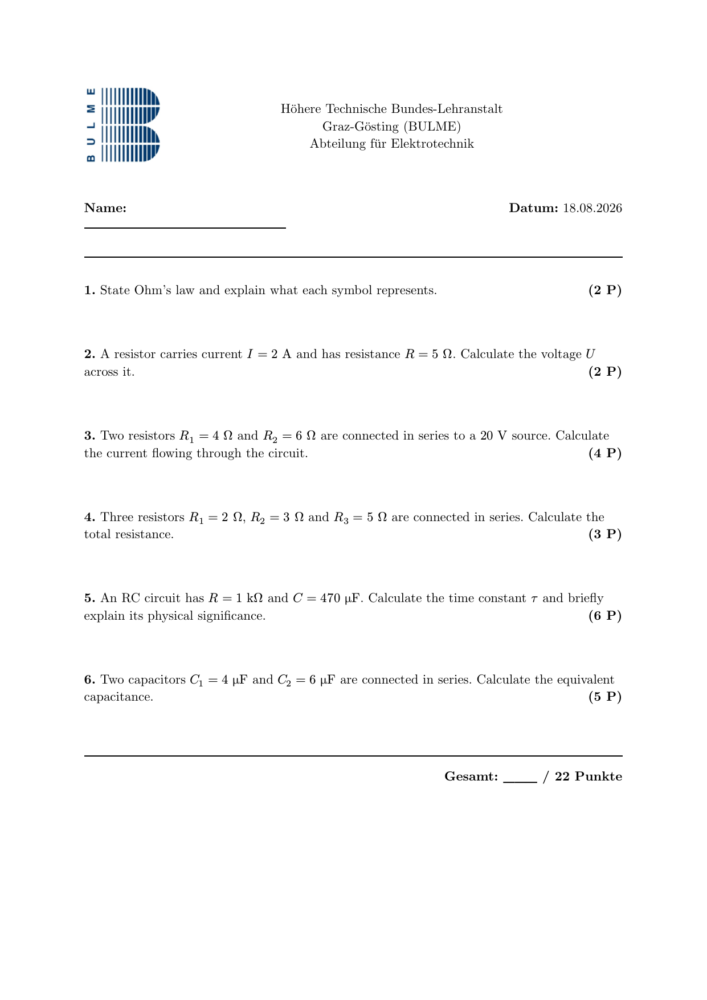

# questforge

[](https://github.com/Gwynspring/questforge/actions/workflows/build.yml)
[](LICENSE)
[](https://en.cppreference.com/w/cpp/20)
[](https://github.com/Gwynspring/questforge/actions/workflows/build.yml)

A C++20 command-line tool that assembles randomized exams from a YAML question catalog and renders them as PDFs via [Typst](https://typst.app).

## Table of Contents
- [What it does](#what-it-does)
- [Features](#features)
- [How it works](#how-it-works)
- [Getting started](#getting-started)
- [Build](#build)
- [Usage](#usage)
- [Question catalog format](#question-catalog-format)
- [School header config](#school-header-config)
- [Project status](#project-status)
- [Contributing](#contributing)
- [AI usage](#ai-usage)
- [License](#license)
- [Third-party notices](#third-party-notices)

## What it does

Given a catalog of questions (with metadata like topic, difficulty, and points), questforge selects a random subset matching your criteria and produces a print-ready PDF. Multiple test variants with different question selections can be generated from the same catalog using explicit seeds for reproducibility.



## Features

- **Randomized selection** — pick a configurable number of easy, medium, and hard questions, optionally restricted to specific topics.
- **Reproducible results** — an explicit seed (`--seed`) makes every run repeatable; important for debugging and for handing out multiple variants of the same exam.
- **Multiple variants** — combine different seeds and filters to generate distinct versions of one test from a single catalog.
- **Print-ready PDFs** — clean, school-friendly layout rendered by Typst; math is written in Typst syntax (not LaTeX).
- **School header** — optional logo and school name lines from a small YAML config (see below).

## How it works

questforge is a small pipeline of independent layers, each testable on its own:

```
CLI (generate command)
   │
   ▼
QuestionRepository — loads and validates the question catalog (YAML)
   │
   ▼
TestGenerator — filters by difficulty/topic and randomly selects questions (seeded)
   │
   ▼
TypstRenderer — fills the Typst template (inja) and invokes `typst compile`
```

The random selection uses the C++ standard library (`<random>`) seeded with an explicit per-run value: with the same seed and the same catalog, the same test is generated every time.

## Getting started

1. Clone the repository:
```bash
git clone https://codeberg.org/Gwynspring/questforge.git
```

2. Install the prerequisites.

**Prerequisites:** CMake ≥ 3.25, Ninja, a C++20 compiler, and internet access for the first `cmake --preset` run. That's it — yaml-cpp, inja, CLI11, spdlog, and GoogleTest are fetched and built from source automatically via CMake's `FetchContent`, pinned to fixed versions in `CMakeLists.txt`. There's nothing to install via a package manager for them.

### Fedora

```bash
sudo dnf install -y cmake ninja-build gcc-c++
```

### Debian / Ubuntu

```bash
sudo apt install -y cmake ninja-build g++
```

### Arch Linux

```bash
sudo pacman -S --needed cmake ninja gcc
```

### All distros

Typst is an external binary that is **not** bundled. Install it following the [official installation guide](https://github.com/typst/typst?tab=readme-ov-file#installation).

## Build

To build the project run the following commands in the project root:

```bash
cmake --preset default
cmake --build build

# Run tests
ctest --test-dir build --output-on-failure
```

## Usage

To generate a test, use the following command:

```bash
./build/questforge generate --catalog data/catalog/algebra.yaml --easy 1 --medium 1 --hard 1 --out /tmp/test.pdf
```

Available options for `generate`:

| Option | Required | Description |
|---|---|---|
| `-c, --catalog` | yes | Path to the YAML question catalog. |
| `-o, --out` | yes | Path of the generated PDF (must end in `.pdf`). |
| `--easy` | no | Number of easy questions to select (default: 0). |
| `--medium` | no | Number of medium questions to select (default: 0). |
| `--hard` | no | Number of hard questions to select (default: 0). |
| `--topics` | no | Comma-separated list of topics to filter by (e.g. `algebra,geometry`). |
| `-s, --seed` | no | Explicit random seed for reproducible selection. |
| `--template` | no | Path to the Typst template (default: `templates/test.typ.jinja`). |
| `--config` | no | Path to a school header config (logo + school name, see below). |
| `--date` | no | `auto` fills in today's date (UTC); any other value is printed as-is; omit to keep a handwritten date line. |

Example with a school header and auto-generated date:

```bash
./build/questforge generate --catalog data/catalog/algebra.yaml --easy 1 \
  --config data/school/bulme.yaml --date auto --out /tmp/test.pdf
```

### Multiple variants

To create several distinct variants of the same test, run the command once per variant with a different seed — e.g. one variant per class group:

```bash
for seed in 1 2 3; do
  ./build/questforge generate --catalog data/catalog/algebra.yaml \
    --easy 2 --medium 2 --hard 1 --seed "$seed" --out "/tmp/test_variant_$seed.pdf"
done
```

## Question catalog format

```yaml
questions:
  - id: alg-001
    topic: algebra
    difficulty: easy      # easy | medium | hard
    points: 2
    text: "Solve: $2x + 3 = 7$"
    image: null           # optional path relative to catalog
    tags: [equations, linear]
```

Fields per question:

| Field | Required | Description |
|---|---|---|
| `id` | yes | Unique identifier within the catalog. |
| `topic` | yes | Topic used for `--topics` filtering. |
| `difficulty` | yes | One of `easy`, `medium`, `hard`. |
| `points` | yes | Points awarded for the question (must be > 0). |
| `text` | yes | Question text; math in Typst syntax. |
| `image` | no | Path to an image, relative to the catalog (default: `null`). |
| `tags` | yes | List of tags (can be empty, e.g. `[]`). |

Math is written in Typst syntax (not LaTeX). If you are not familiar with it, see the [official Typst tutorial](https://typst.app/docs/tutorial/).

## School header config

With `--config`, the generated PDF gets a school header: an optional logo on
the left and the school name lines centered next to it (see
`data/school/bulme.yaml` for an example).

```yaml
school:
  - Höhere Technische Bundes-Lehranstalt
  - Graz-Gösting (BULME)
  - Abteilung für Elektrotechnik
logo: bulme.png
```

| Field | Required | Description |
|---|---|---|
| `school` | yes | List of text lines, rendered centered in the header. |
| `logo` | no | Path to the logo image, resolved relative to the config file. |

Without `--config`, no header is rendered. The date is controlled
independently via `--date`: `auto` prints today's date (UTC), any other
value is printed verbatim, and omitting the flag keeps a blank line for a
handwritten date.

## Project status

First prototype is finished. What started as a personal learning project is evolving into a tool meant for real use by teachers — right now I'm hardening the current code before adding new features.

## Contributing
This is a personal project I'm using to learn C++. It's not accepting contributions or pull requests at this time.

## AI usage
This project is developed with AI assistance (opencode) used as a learning aid, not as an author of core logic. See [AI_USAGE.md](AI_USAGE.md) for details.

## License
MIT — see [LICENSE](LICENSE).

## Third-party notices
questforge links against yaml-cpp, inja (which vendors nlohmann/json), CLI11, and spdlog (all MIT/BSD-3-Clause) and shells out to the separately-installed [Typst](https://typst.app) CLI. License texts for everything bundled into the compiled binary are in [THIRD_PARTY_NOTICES.md](THIRD_PARTY_NOTICES.md).
